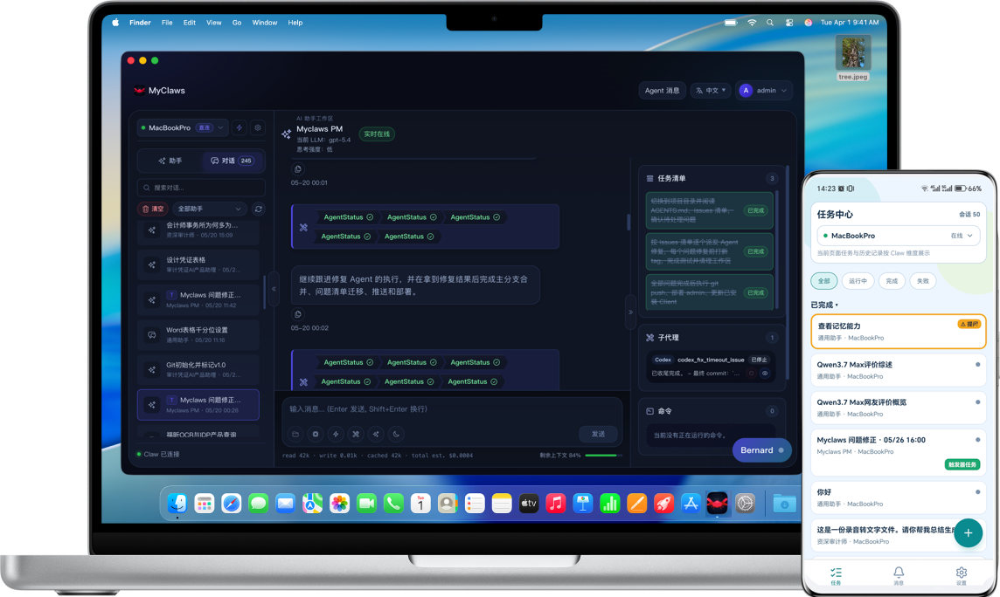

# MyClaws



> Deploy AI agents to any machine. Control them from one desktop or phone.

[中文说明](./README.zh-CN.md) · [Operations Docs](./run_docs/README.md) · [Architecture](./dev_docs/project_knowledge/architecture.md) · [Developer Docs](./dev_docs/index.md) · [License](./LICENSE) · [Commercial Terms](./COMMERCIAL_LICENSE.md) · [Code of Conduct](./CODE_OF_CONDUCT.md) · [Contributing](./CONTRIBUTING.md) · [Security](./SECURITY.md)

MyClaws is a public-source AI agent platform built for people who want to remotely control many real machines from one control plane, without platform-imposed host caps or extra sandbox walls. You can route complex work to frontier models, keep full access to the real environment on each host, and shape the workflow with your own experts, tools, skills, and MCP stack.

If you are coming from OpenClaw or other terminal-first agent runners, the biggest shift is simple: MyClaws is built around multi-machine fleet control, human-in-the-loop conversations, and dedicated clients instead of a single terminal session on a single computer.

## Positioning vs Other Agent Tools

> Snapshot based on official product pages and docs reviewed on 2026-05-21.

| Product | Primary surface | Where the agent actually runs | Multi-machine remote control | Sandbox / execution style | Best fit |
|---|---|---|---|---|---|
| **MyClaws** | Dedicated desktop client, mobile app, Admin web entry | Your own Windows / macOS / Linux Claw hosts | **Yes**. Built around switching and operating many hosts from one UI | **Unsandboxed by default**. Runs with the permissions of the host account you choose | Operators and power users who want one control plane for many real machines |
| **OpenClaw** | Chat apps, browser UI, voice / call channels | A self-hosted gateway and connected tools | Channel reach is broad, but host-fleet control is not the core product shape | Self-hosted assistant workflow | People who want one assistant reachable from Telegram, WhatsApp, browser, and voice |
| **Claude Code** | Terminal, IDE extensions, desktop app, web | Local dev environment plus Anthropic-managed coding surfaces | Strong coding workflow handoff, but not a remote host fleet control plane | Permissioned coding-agent workflow with product-managed surfaces | Developers who want Claude embedded in everyday coding tools |
| **Codex** | ChatGPT-linked coding agent, terminal, cloud tasks | Local and cloud environments managed through Codex surfaces | Multi-task coding across environments, but not a self-managed host operations dashboard | Managed coding-agent workflow oriented around Codex environments | Teams who want OpenAI coding agents tightly connected to ChatGPT and cloud execution |
| **OpenCode** | Terminal, IDE, desktop | Mainly the local project session you open | Good local agent ergonomics, not a remote multi-host control layer | Open-source, local-first coding agent workflow | Developers who want an open-source coding agent inside their dev tools |

The practical difference is that MyClaws is not trying to be just another coding shell. It is a remote operations layer for AI work: connect many machines, pick the strongest model for the task, keep humans in the loop, and avoid artificial caps that get in the way of real execution.

## Overview

- `Admin` manages identity, configuration, files, and centralized memory.
- `Claw` runs on each host that actually executes agents and tools.
- `Client` is the desktop control center for long-running work.
- `Mobile` keeps you connected when you are away from your desk.

That split makes it practical to run agents on an office Mac, a home Linux box, and a cloud GPU machine at the same time, then switch between them from one UI.

## Why MyClaws?

> Most coding-agent tools are still single-machine and terminal-bound. MyClaws takes a different path.

| | MyClaws | Typical terminal-first agent |
|---|---|---|
| **Host control** | Multi-machine fleet, one dashboard | Usually one machine or one shell at a time |
| **Install and switch** | Register a host once, then switch targets from desktop or mobile | More manual host switching, SSH hopping, or per-machine setup |
| **Conversation model** | Human-controlled turns with easy-to-review history | More fire-and-forget or terminal-scroll-heavy workflows |
| **Client experience** | Dedicated desktop and mobile apps, plus file transfer, sub-agent controls, and todo panels | Terminal or browser-first experience |
| **Experts** | Custom experts with their own prompts, tools, skills, MCP, and working patterns | Lighter profile customization |
| **Debugging** | Bernard meta-agent helps inspect and tune agent behavior | More manual log reading and prompt guesswork |
| **Memory** | Centralized layered memory by user, Claw host, and project | More local, flatter memory setups |
| **Observability** | Real-time context, token, tool, and compaction visibility | Less live context introspection |
| **Parallelism** | Multiple concurrent tasks and no platform cap on sub-agents per task | More session-oriented limits |
| **Execution model** | Local-first, self-managed, unsandboxed power-user model | Often sandboxed or more opinionated |

## Highlights

- **Multi-machine, one dashboard**: run Claws on as many machines as you need and move between them without changing your workflow.
- **Human-in-the-loop by default**: every conversation is turn-based and reviewable, so you stay in control instead of handing everything to autopilot.
- **Dedicated desktop and mobile clients**: use purpose-built UIs for file transfer, sub-agent control, todo visibility, notifications, and task follow-up.
- **Custom experts**: define specialists with their own prompts, tools, skills, MCP integrations, and operating style.
- **Bernard-assisted debugging**: use the built-in meta-agent to understand what another agent is doing and how to tune it.
- **Centralized layered memory**: persist knowledge by user, environment, and project so context survives machine switches.
- **Dream-style memory consolidation**: periodically distill raw memories into more structured long-term knowledge.
- **Real-time context inspector**: watch token usage, tool calls, and compaction events while a task is running.
- **Concurrent multi-tasking**: keep multiple conversations active at once, with sub-agent fan-out limited by your provider quotas and host resources rather than an arbitrary platform cap.

## Architecture

```text
┌─────────┐  HTTPS REST  ┌──────────┐  WebSocket  ┌─────────┐
│  Admin  │◄────────────►│  Client  │◄───────────►│  Claw   │
│ Fastify │              │Electron  │              │ Fastify │
└────┬────┘              └──────────┘              └────┬────┘
     │ A↔C: auth, config, skills, MCP, files, memory   │
     └──────────────────────────────────────────────────┘
          ▲ HTTPS REST + WebSocket
          │
   ┌──────┴───────┐
   │    Mobile    │
   │ Expo / RN    │
   └──────────────┘
```

| Component | Role |
|---|---|
| `Admin` | Authentication, configuration, files, centralized memory, download and coordination services |
| `Claw` | Agent runtime, tool execution, WebSocket sessions, local persistence |
| `Client` | Desktop control center for conversations, host switching, and rich task UI |
| `Mobile` | Follow-up, notifications, and intervention from Android clients in the current public release |

## Typical workflows

- **One person, many machines**: keep one Claw on your laptop, another on a home server, and another on a cloud box; pick the right machine for each task from the same client.
- **Long-running engineering conversations**: drive debugging, architecture review, or code editing as a human-guided dialogue instead of a single unattended run.
- **On-the-go supervision**: start a task on desktop, answer agent questions from your phone, and come back later with full history intact.

## Screenshots and demo

The current public release uses the demo image shown at the top of this README. More walkthrough assets can be added later, but the repository no longer ships placeholder screenshot sections.

## Quick start

### Install released builds

- Desktop and mobile clients: [GitHub Releases](https://github.com/weidwonder/myclaws-releases/releases) (`Android / Windows / macOS`)
- Agent backend on remote hosts:

```bash
curl -fsSL https://myclaws.ai/install/claw.sh | bash
```

```powershell
irm https://myclaws.ai/install/claw.ps1 | iex
```

### Prerequisites

- `Node.js >= 20`
- `pnpm >= 9`

### Install

```bash
pnpm install
```

### Configure

Start from the sanitized root example:

```bash
cp .env.example .env
```

Key variables from `.env.example`:

| Variable | Purpose | Example |
|---|---|---|
| `ADMIN_API_URL` | Admin entry point used by local tools and deployment helpers | `https://central.myclaws.ai` or your own Admin URL |
| `ADMIN_DEPLOY_SSH_USER` | SSH user for remote install and update workflows | `deploy` |
| `ADMIN_DEPLOY_TARGETS` | Named deployment targets | `office:192.0.2.10,cloud:198.51.100.20` |
| `CLIENT_WEB_PORT` | Desktop web dev port | `5173` |
| `CLIENT_ELECTRON_DEV_PORT` | Electron dev port | `5179` |

Optional client branding variables live in `./packages/client/.env.example`.

### Run the development stack

```bash
# Terminal 1
pnpm dev:admin

# Terminal 2
pnpm dev:claw

# Terminal 3
pnpm dev:client
```

Mobile development:

```bash
pnpm --filter @myclaws/mobile dev
```

If you change shared types, rebuild them first:

```bash
pnpm --filter @myclaws/shared build
```

Optional bootstrap after Admin starts:

```bash
pnpm seed:agents
```

## Build and validate

```bash
pnpm build
pnpm verify:unit
```

Additional operational guides are listed in `./run_docs/README.md`.

## Security model and privacy

> Warning: MyClaws does **not** add a sandbox layer around your agents.

MyClaws is intentionally local-first and self-managed. A Claw runs with the permissions of the operating-system account that launches it. That gives you full control over files, tools, and environments on that host, and it also means you carry the risk.

- Use dedicated low-privilege accounts, isolated hosts, containers, or VMs where appropriate.
- Keep secrets in environment variables or secret managers, not in prompts or pasted chat history.
- Review custom experts, skills, MCP servers, and remote hosts before enabling them.
- Treat each connected Claw host as a privileged execution environment.
- Prefer separate credentials and storage boundaries for personal, work, and production contexts.

This model is best suited to engineers and advanced users who are comfortable managing their own operational risk.

## Documentation

- `./run_docs/README.md` — public operations and deployment document index
- `./run_docs/claw-install-guide.md` — install Claw on Linux, macOS, or Windows
- `./run_docs/admin-server-ops.md` — Admin operations template for public deployment
- `./dev_docs/project_knowledge/architecture.md` — deeper system architecture
- `./dev_docs/project_knowledge/project-context.md` — project context and design principles
- `./dev_docs/index.md` — full developer documentation index

## License and commercial authorization

MyClaws is being published in **public-source / source-available** form. Unless a final `LICENSE` file explicitly says otherwise, do **not** assume this repository is OSI-approved open source.

Current licensing direction:

- Personal, non-commercial use is intended to be free.
- Commercial use requires paid written authorization.
- Derivative works, redistribution, or commercial hosted offerings also require paid written authorization unless your final license text says otherwise.

See `./LICENSE` and `./COMMERCIAL_LICENSE.md` for the current public draft text. This summary is informational only and does not replace the final license text or any separately signed commercial agreement. Please ask your own counsel to review the governing terms before commercial or derivative use.

## Roadmap

- Publish sanitized screenshots, short demos, and first-run walkthroughs
- Finalize legal review and commercial process details for the public release
- Improve self-hosting and multi-machine deployment templates
- Expand observability, memory tooling, and cross-device workflows
- Harden public release automation and documentation polish

## Contributing

Public contribution guidance is being prepared. For now:

- Start with `./CONTRIBUTING.md`
- Open an issue before large feature work
- Keep pull requests sanitized and free of secrets, internal IPs, and private operational details

## Security disclosure

Please use the private reporting guidance in `./SECURITY.md` for vulnerabilities. Do not publish exploit details in public issues before the disclosure workflow is complete.

## Acknowledgments

MyClaws builds on the wider agent and developer-tool ecosystem, including ideas from terminal coding agents, Electron, Expo, Vue, React Native, Fastify, and modern LLM tool orchestration workflows.
